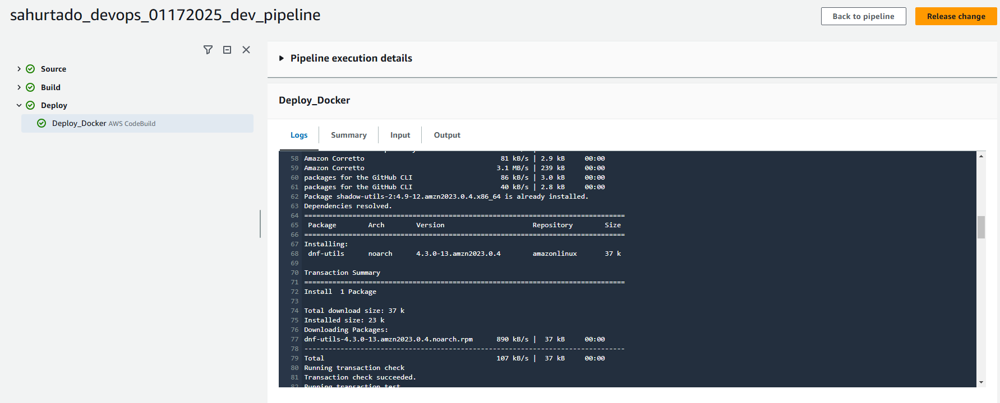
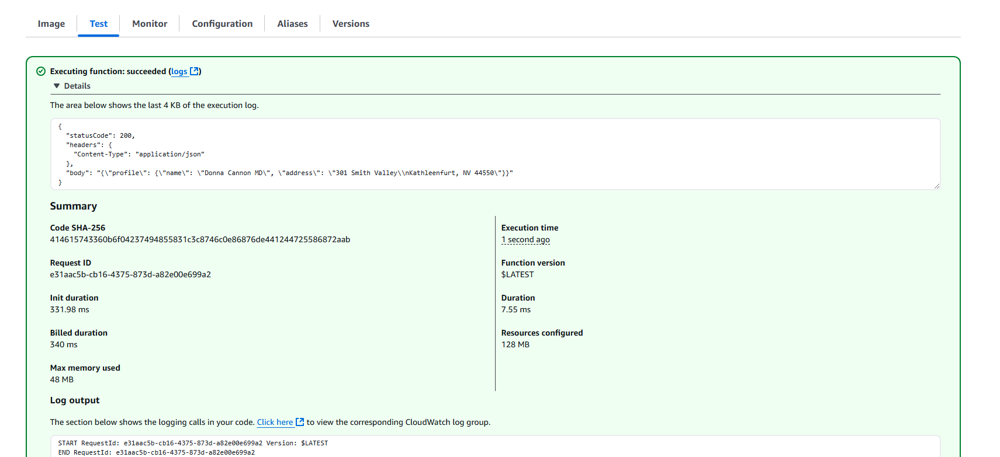

# Containerized AWS Lambda Deployments with Terraform

We will be provisioning AWS Codepipeline and its supporting AWS Services like AWS Codbuild and AWS ECR and finally using the provisioned codepipeline to provision lambda resource and deploy a sample lambda application ref folder: aws_lambda_functions into AWS.
__________________________________________________________________

## Pre-requisites

This code is split into two parts,

1. Infrastructure for Codepipeline Deployment. ie, code under the path ```terraform/```
2. Uploading the Lambda code to CodeCommit Repository. ie, lambda code on path ```aws_lambda_functions/```

To achieve this, follow the pre-requisites steps below

1. Install Terraform : [link](https://learn.hashicorp.com/tutorials/terraform/install-cli)
2. Install AWS CLI : [link](https://docs.aws.amazon.com/cli/latest/userguide/getting-started-install.html)
3. Configure AWS CLI with AWS Account do : [link](https://docs.aws.amazon.com/cli/latest/userguide/cli-chap-configure.html)
4. Create a S3 Bucket in us-east-1. This bucket will be used to store the terraform state file. Note the bucket arn as it will be used in the steps below.
6. Create a github repository where you will store all the files you find here
5. Create a github connection : [link](https://docs.aws.amazon.com/codepipeline/latest/userguide/connections-github.html) Note the connection arn and the name of the github repository to be used in the following steps.


## Folder Structure
```
.
|-- img
|   |-- codepipeline-output.png
|   `-- codepipeline-using-terraform.png
|-- aws_lambda_functions
|   |-- profile_faker
|   |   |-- Dockerfile
|   |   |-- main.py
|   |   `-- requirements.txt
|   |-- main.tf
|   |-- outputs.tf
|   |-- providers.tf
|   |-- terraform.tfvars
|   |-- variables.tf
|   `-- versions.tf
|-- terraform
|   |-- modules
|   |   |-- codecommit
|   |   |   |-- main.tf
|   |   |   |-- outputs.tf
|   |   |   `-- variables.tf
|   |   |-- codepipeline
|   |   |   |-- templates
|   |   |   |   |-- buildspec_build.yml
|   |   |   |   `-- buildspec_deploy.yml
|   |   |   |-- main.tf
|   |   |   |-- outputs.tf
|   |   |   |-- roles.tf
|   |   |   `-- variables.tf
|   |   `-- ecr
|   |       |-- main.tf
|   |       |-- outputs.tf
|   |       `-- variables.tf
|   |-- main.tf
|   |-- outputs.tf
|   |-- providers.tf
|   |-- terraform.tfvars
|   |-- variables.tf
|   `-- versions.tf
`-- README.md
```

## Provision Infrastructure and Lambda code

Deploying the Infrastructure:

1. Navigate to the directory `cd create-codepipeline-using-terraform/terraform` 
2. Open the file `terraform.tfvars` and change the ORG_NAME, TEAM_NAME and PROJECT_ID. Example file below,

```
org_name               = "sahurtado"
team_name              = "devops"
region                 = "us-east-1"
project_id             = "01172025"
codebuild_compute_type = "BUILD_GENERAL1_MEDIUM"
codebuild_image        = "aws/codebuild/amazonlinux-x86_64-standard:5.0"
codebuild_type         = "LINUX_CONTAINER"
codecommit_branch      = "main"

```

3. Change the BUCKET_NAME in the file `terraform-containerized-lambda-deployment/terraform/providers.tf` with the bucket you created in pre-requisites. Use the bucket name, not the ARN
4. Change the BUCKET_NAME in the file `terraform-containerized-lambda-deployment/aws_lambda_functions/providers.tf` with the bucket you created in pre-requisites. Use the bucket name, not the ARN
5. Change the BUCKET_NAME in the file `terraform-containerized-lambda-deployment/terraform/modules/codepipeline/roles.tf` with the bucket you created in pre-requisites. Use the Bucket ARN here.
6. Change the name in aws_codestarconnections_connection" "githubconnection"  in the file `terraform-containerized-lambda-deployment/terraform/modules/codepipeline/main.tf` with the name of the connection you created in pre-requisites.
7. 6. Change the FullRepositoryId  in the file `terraform-containerized-lambda-deployment/terraform/modules/codepipeline/main.tf` with the name of the repository you created in pre-requisites.

You are all set. Let's run the code

1. Navigate to the directory `cd terraform-containerized-lambda-deployment/terraform` 
2. Run `terraform init`
3. Run `terraform validate`
4. Run `terraform plan`  and review the output in `terminal`
5. Run `terraform apply` and review the output in `terminal` and when ready, type `yes` and hit enter
6. You should be seeing a output similar to this:

   ```
   Apply complete! Resources: 10 added, 0 changed, 0 destroyed.
   
   Outputs:

   codecommit = "https://git-codecommit.us-east-1.amazonaws.com/v1/repos/sahurtado_devops_01172025_code_repo"

   codepipeline = "arn:aws:codepipeline:us-east-1:<account#>:sahurtado_devops_01172025_dev_pipeline"

   ecrrepo = "<account#>.dkr.ecr.us-east-1.amazonaws.com/sahurtado_devops_01172025_repo"
  
   ```

We have completed provisioning the Infrastructure and now codepipeline push the Lambda code to codecommit which will trigger codepipeline to deploy the lambda code. 

7. You can now navigate to AWS Codepipeline from `aws console` and check the pipeline status.

8. If everything goes well, you should be seeing an output simillar to this:   

## Invoking functions with test events


To test a function

1. Open the Functions page of the Lambda console.

2. Choose the name of the function that you want to test in this cas ethe name of the lambda is profile-faker-sahurtado_devops_01172025_dev.

3. Choose the Test tab.

4. Under Test event, choose Create new event or Edit saved event and then choose the saved event that you want to use.

5. Optionally - choose a Template for the event JSON.

6. Choose Test.

7. To review the test results, under Execution result, expand Details. you should be seeing an output simillar to this



